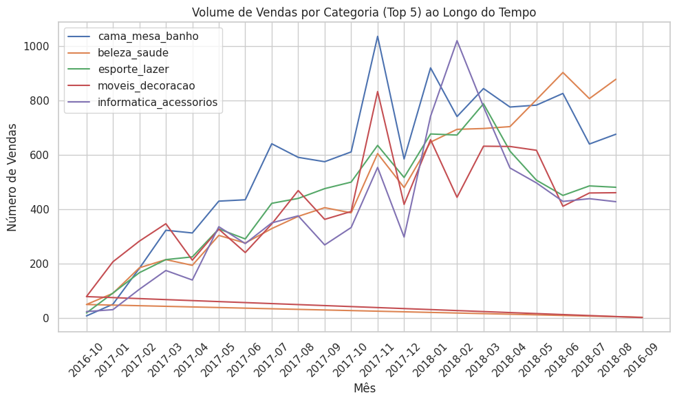
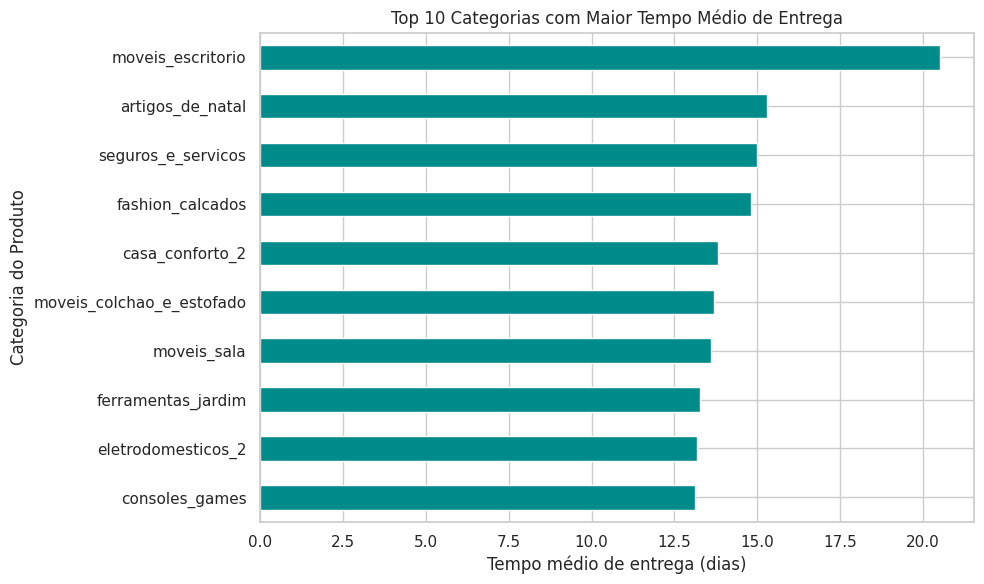
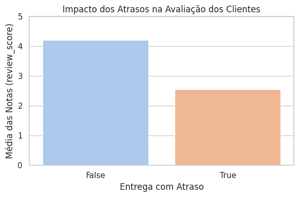
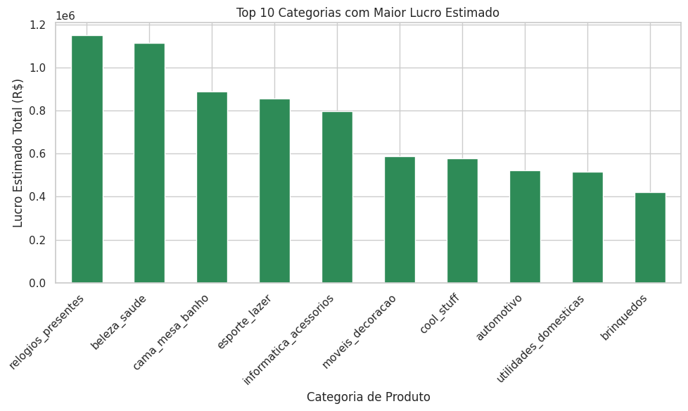
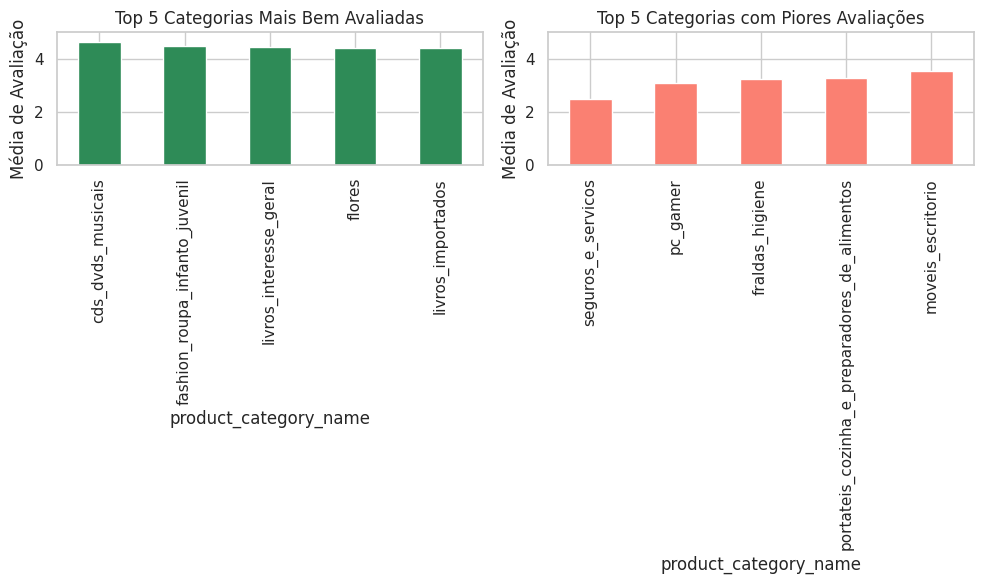

# Desafio Bemol Digital Talent Lab 2025

---

## 1. Introdução

O **Desafio Bemol Digital Talent Lab 2025** foi proposto com o objetivo de realizar uma análise completa de um dataset de e-commerce da Olist, uma plataforma de vendas online. O desafio buscava identificar e gerar insights estratégicos a partir de dados relacionados a **vendas**, **logística**, **satisfação do cliente**, **finanças** e **marketing**. Este projeto envolveu uma série de etapas de processamento de dados, desde a **limpeza e transformação** até a análise exploratória e geração de visualizações, com foco na tomada de decisões para otimizar processos e melhorar a experiência do cliente.

O dataset contém informações detalhadas sobre pedidos realizados na plataforma Olist, incluindo dados de **produtos**, **clientes**, **vendedores**, **entregas** e **pagamentos**, permitindo uma visão ampla de como os diferentes aspectos do processo de vendas impactam os resultados financeiros e a satisfação dos consumidores.

## 2. Objetivos das Análises

O desafio propôs analisar as seguintes questões:

- **Performance de Vendas**: Identificar as categorias de produtos com o maior volume de vendas e em quais períodos.
- **Logística**: Calcular o tempo médio de entrega e identificar os fatores que influenciam os atrasos.
- **Satisfação do Cliente**: Examinar a relação entre atrasos na entrega e a satisfação do cliente.
- **Análise Financeira**: Calcular a lucratividade de diferentes categorias de produtos.
- **Análise Extra**: Avaliar as melhores e piores avaliações dos produtos.

## 3. Etapas da Análise

### 3.1. ETAPA 1 - Configuração Inicial
- **Importação das Bibliotecas**:
  - `pandas`: para manipulação e análise de dados.
  - `matplotlib` e `seaborn`: para visualização de dados.
- **Definição de Opções de Visualização**: Exibição completa de colunas e linhas de dados.

### 3.2. ETAPA 2 - Upload e Leitura dos Dados
- Carregamento dos arquivos CSV contendo dados sobre:
  - Pedidos, produtos, clientes, entregas, localização e categorias.
  - Utilização de pandas para leitura dos dados.

### 3.3. ETAPA 3 - Análise Exploratória Inicial
- **Visualização das Primeiras Linhas**: Inspeção das primeiras 5 linhas dos principais DataFrames para entender a estrutura e verificar a qualidade dos dados.
- **Identificação de Dados Faltantes**: Verificação de dados ausentes ou inconsistentes.

### 3.4. ETAPA 4 - Limpeza e Transformação dos Dados
- Conversão de colunas de data para o tipo `datetime` para permitir análise temporal precisa (como cálculos de prazos de entrega).
- Remoção de registros com dados faltantes ou negativos, especialmente em colunas cruciais como datas e tempos de entrega.

### 3.5. ETAPA 5 - Integração das Tabelas
- Junção de tabelas principais (pedidos, itens, produtos, avaliações, pagamentos, vendedores e clientes) para criar um DataFrame consolidado.
- **Relacionamento entre Tabelas**: Uso de chaves como `order_id`, `product_id`, `seller_id`, e `customer_id`.

### 3.6. ETAPA 6 - Definição das Questões de Análise
As questões de análise foram definidas da seguinte forma:

- **Performance de Vendas**: Análise do volume de vendas por categoria.
- **Logística**: Cálculo dos prazos médios de entrega e análise dos atrasos.
- **Satisfação do Cliente**: Impacto dos atrasos na satisfação do cliente.
- **Análise Financeira**: Cálculo da lucratividade de cada categoria.
- **Análise Extra**: Análise das melhores e piores avaliações dos produtos.

### - Ambiente utilizado

Neste desafio, foi utilizado o ambiente do Google Colab para realizar a análise de dados e gerar os insights necessários para a resolução do problema proposto pela Bemol Digital. O Colab é uma plataforma interativa baseada em notebooks Jupyter, que permite a execução de código Python e análise de dados de maneira colaborativa.

Abaixo, tem-se uma captura de tela do notebook aberto no Colab, onde todo o processo de ETL (Extração, Transformação e Carga de Dados) foi realizado, além da análise exploratória de dados.

O notebook contém todas as etapas detalhadas do processo, incluindo o carregamento e limpeza dos dados, a análise exploratória, e a geração de gráficos para ilustrar os resultados obtidos.

## 4. Resultados das Análises

### 4.1. Performance de Vendas

A análise de **Volume de Vendas por Categoria** revelou que:

- A categoria **"cama_mesa_banho"** se destacou com o maior volume de vendas, especialmente no final de 2017 (Black Friday e Natal).
- Houve picos sazonais nas vendas, como entre **novembro e dezembro de 2017**, além de **março e abril de 2018**.
- A categoria **"informatica_acessorios"** também teve um crescimento significativo até o início de 2018, superando outras categorias nesse período.

### 4.2. Logística

A análise dos **Prazos de Entrega** revelou que:

- **Categorias com maior tempo médio de entrega**: 
  - *"moveis_escritorio"* e *"artigos_de_natal"* possuem maior tempo médio de entrega (aproximadamente 20 dias).
- A análise do **Percentual de Atrasos por Categoria** indicou que:
  - A categoria *"casa_conforto_2"* tem o maior percentual de atrasos.
  - Produtos de grande volume e peso enfrentam mais dificuldades logísticas, o que impacta nos atrasos.
  

### 4.3. Satisfação do Cliente

A análise do **Impacto dos Atrasos na Satisfação do Cliente** revelou que:

- **Pedidos entregues no prazo** têm uma média de avaliação superior a 4.
- **Pedidos com atraso** têm uma média de avaliação inferior a 3, mostrando a insatisfação dos clientes com os atrasos.

### 4.4. Análise Financeira

A análise de **Lucro Estimado por Categoria** mostrou que:

- A categoria **"relogios_presentes"** tem a maior lucratividade estimada, superando R$ 1 milhão.
- **"beleza_saude"** e **"cama_mesa_banho"** também têm margens financeiras elevadas devido ao alto volume de vendas e baixo custo de frete.
  

### 4.5. Análise Extra: Avaliações Extremas

A análise de **Avaliações Extremas** indicou que:

- As categorias **"beleza_saude"** e **"cama_mesa_banho"** têm as melhores avaliações médias.
- **"automotivo"** e **"fashion_calçados"** apresentam as piores avaliações médias.

## 5. Conclusão Final

A análise na base de dados Olist foi realizada com o objetivo de desenvolver uma solução para o desafio da Bemol Digital – Talent Lab 2025. A abordagem adotada envolveu um processo completo de ETL, análise exploratória e geração de insights a partir de cinco eixos temáticos principais: Performance de Vendas, Logística, Satisfação do Cliente, Análise Financeira e uma Análise Extra. Com base nesse estudo, foram extraídas informações cruciais que contribuem para uma melhor compreensão do comportamento de vendas e desempenho operacional, apoiando a tomada de decisões estratégicas. Preparei o ambiente com bibliotecas como pandas, matplotlib e seaborn, extraí os dados, tratei valores ausentes, converti datas e integrei diversas fontes, criando um DataFrame consolidado para análises robustas.

### 5.1 **Principais Análises**
- **Performance de Vendas**: A categoria `cama_mesa_banho` teve o maior volume de vendas, com picos sazonais em novembro e dezembro de 2017. A análise de geolocalização também revelou variações regionais importantes.
- **Logística**: A categoria `moveis_escritorio` apresentou o maior tempo de entrega, superando 20 dias. A análise geográfica mostrou diferentes desempenhos logísticos entre estados e cidades.
- **Satisfação do Cliente**: Atrasos nas entregas reduziram a média das avaliações, com notas abaixo de 3 para entregas com atraso. A análise por região e tipo de produto trouxe insights sobre como melhorar a experiência do cliente.
- **Análise Financeira**: A categoria mais lucrativa foi `relogios_presentes`, seguida por `beleza_saude`. A análise de desempenho por vendedor também destacou áreas prioritárias.
- **Análise Extra**: As categorias `cds_dvds_musicais` e `flores` receberam boas avaliações, enquanto `pc_gamer` e `portateis_cozinha` apresentaram críticas negativas. Os comentários ajudaram a identificar causas específicas de insatisfação.

## 6. **Aprendizados e Contribuições**
O desafio reforçou ainda mais meu interesse em trabalhar com dados aplicados a negócios, permitindo demonstrar habilidades técnicas e analíticas. As análises forneceram insights valiosos e foram sempre focadas em responder questões práticas, com visualizações claras e organização eficiente. Tive maior afinidade com a **análise de satisfação do cliente**, percebendo como a logística impacta diretamente na experiência do consumidor. Essa análise pode transformar decisões estratégicas e gerar impacto positivo no relacionamento com os clientes.

## 7. Bibliotecas Utilizadas

- `pandas` - Para manipulação e análise de dados.
- `matplotlib` e `seaborn` - Para visualização de dados.

## 8. Como Executar

1. **Carregar os Arquivos CSV**: Faça o upload dos arquivos de dados no ambiente de execução.
2. **Executar o Notebook**: Execute as células do notebook conforme as etapas descritas.
3. **Visualizar os Resultados**: Os gráficos serão gerados automaticamente durante a execução das etapas de análise.

## 9. Referências

- **Dataset**: O dataset utilizado foi o olist como parte do desafio Bemol Digital – Talent Lab 2025.
